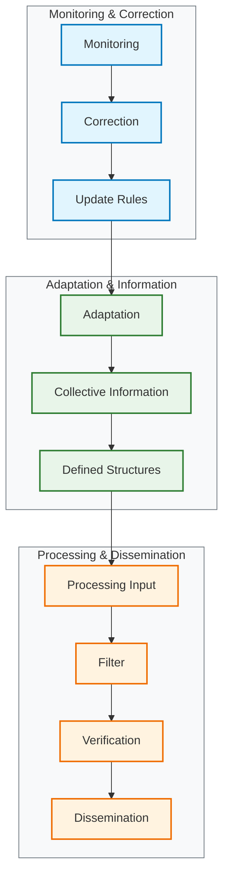

# Influence as Capability

```mermaid
flowchart TD

    %% Group 1 – Monitoring & Correction
    subgraph MC ["Monitoring & Correction"]
        A1[Monitoring]
        A2[Correction]
        A3[Update Rules]
    end

    %% Group 2 – Adaptation & Information
    subgraph AI ["Adaptation & Information"]
        B1[Adaptation]
        B2[Collective Information]
        B3[Defined Structures]
    end

    %% Group 3 – Processing & Dissemination
    subgraph PD ["Processing & Dissemination"]
        C1[Processing Input]
        C2[Filter]
        C3[Verification]
        C4[Dissemination]
    end

    %% Arrows between all steps
    A1 --> A2
    A2 --> A3
    A3 --> B1
    B1 --> B2
    B2 --> B3
    B3 --> C1
    C1 --> C2
    C2 --> C3
    C3 --> C4

    %% Styling: colours and box borders
    classDef monitoringStyle fill:#e1f5fe,stroke:#0277bd,stroke-width:2px
    classDef adaptationStyle fill:#e8f5e9,stroke:#2e7d32,stroke-width:2px
    classDef processingStyle fill:#fff3e0,stroke:#ef6c00,stroke-width:2px
    classDef subgraphStyle fill:#f8f9fa,stroke:#6c757d,stroke-width:1px

    class A1,A2,A3 monitoringStyle
    class B1,B2,B3 adaptationStyle
    class C1,C2,C3,C4 processingStyle

    class MC,AI,PD subgraphStyle
```

